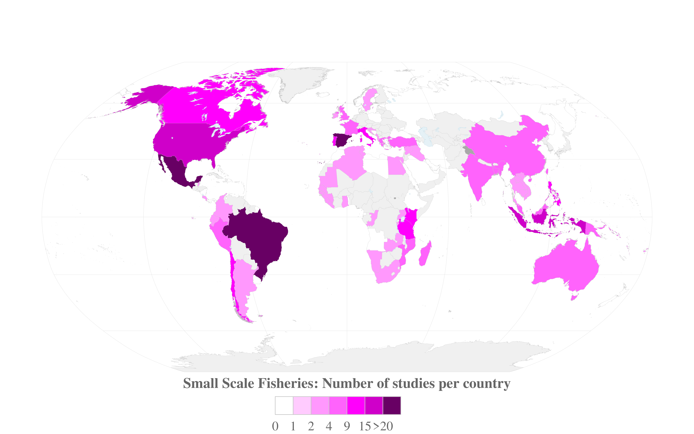

# IPBES Sustainable Use Assessment - Figure Chap3 Small-scale Fisheries

This repository contains the code to reproduce the Figure 'Small-scale Fisheries' of 
the chapter 3 of the **IPBES Sustainable Use Assessment**. This figure shows the 
the global distribution of 350 reviewed studies on small-scale fisheries.

## Requierements

Two spatial layers are required and must be added in the folder `data/`:
- World maritime boundaries EEZ v11 (available [here](https://marineregions.org/downloads.php))
- Natural Earth ocean boundaries (available [here](https://www.naturalearthdata.com/downloads/50m-physical-vectors/50m-ocean/))

## Usage

First clone this repository, then open the R script `make.R` and run it.
This script will read data stored in the folder `data/` and export the figure
in the folder `figures/`.

## License

This work is licensed under 
[Creative Commons Attribution 4.0 International](https://choosealicense.com/licenses/cc-by-4.0/).

Please cite this work as: [...]

